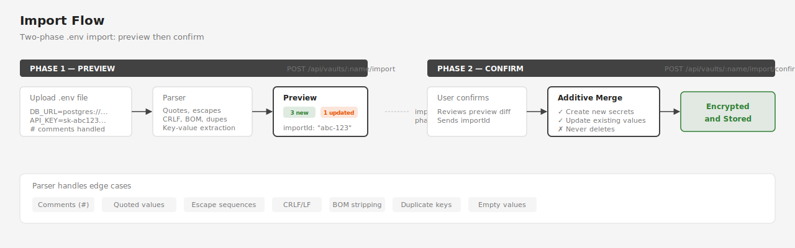

# API Reference

All endpoints are under `/api/vaults`. The full specification with request/response examples lives in [spec-docs/API-SPEC.md](../spec-docs/API-SPEC.md).

## Response Envelope

Every response follows the same shape:

```json
{ "success": true, "data": { ... } }
{ "success": false, "error": "human-readable message" }
```

## Status Codes

| Code | Meaning |
|------|---------|
| 200 | Success |
| 400 | Validation error (bad input, wrong password) |
| 404 | Vault or secret not found |
| 409 | Conflict (vault already exists) |
| 423 | Vault is locked (operation requires unlock) |

## Endpoint Summary

### Vault Lifecycle

| Method | Path | Description |
|--------|------|-------------|
| `GET` | `/api/vaults` | List all vaults with metadata |
| `POST` | `/api/vaults` | Create vault (returns recovery key) |
| `DELETE` | `/api/vaults/:name` | Delete vault permanently |
| `GET` | `/api/vaults/:name/status` | Single vault status |
| `POST` | `/api/vaults/:name/unlock` | Unlock with password |
| `POST` | `/api/vaults/:name/lock` | Lock vault |
| `POST` | `/api/vaults/:name/change-password` | Change master password |
| `POST` | `/api/vaults/:name/recover` | Reset password via recovery key |

### Secrets (require unlock)

| Method | Path | Description |
|--------|------|-------------|
| `GET` | `/api/vaults/:name/secrets` | List secrets with groups and order |
| `GET` | `/api/vaults/:name/secrets/:secret` | Get single secret value |
| `POST` | `/api/vaults/:name/secrets/:secret` | Create or update secret |
| `DELETE` | `/api/vaults/:name/secrets/:secret` | Delete secret |

### Groups (require unlock)

| Method | Path | Description |
|--------|------|-------------|
| `GET` | `/api/vaults/:name/groups` | List groups with their secrets |
| `POST` | `/api/vaults/:name/groups` | Create group |
| `PATCH` | `/api/vaults/:name/groups/:group` | Rename or move secrets |
| `DELETE` | `/api/vaults/:name/groups/:group` | Delete group (ungroups secrets) |
| `PUT` | `/api/vaults/:name/order` | Reorder secrets and groups |

### Import (require unlock)

| Method | Path | Description |
|--------|------|-------------|
| `POST` | `/api/vaults/:name/import` | Preview .env import |
| `POST` | `/api/vaults/:name/import/confirm` | Apply previewed import |



The import is a two-phase operation. Phase 1 parses the `.env` content and returns a diff preview (new, updated, unchanged counts) along with an `importId`. Phase 2 accepts the `importId` to apply the changes. The merge strategy is additive — new secrets are created, existing ones updated, nothing is deleted.

## Vault Naming Rules

- Pattern: `/^[a-z][a-z0-9-]*$/` (lowercase alphanumeric + hyphens, starts with letter)
- Maximum length: 64 characters
- Reserved: `default`

## Secret Naming Rules

- Pattern: `/^[A-Za-z_][A-Za-z0-9_]*$/`
- Matches standard environment variable naming conventions

## Full Specification

For complete request/response schemas, flow descriptions, and error cases, see [spec-docs/API-SPEC.md](../spec-docs/API-SPEC.md).
