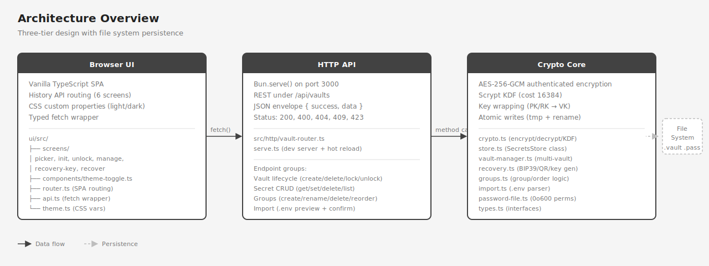

# Architecture

tkr-secrets is a three-tier application: a cryptographic core library, an HTTP API layer, and a browser-based SPA.



## Tiers

### Crypto Core (`src/`)

The bottom tier handles all encryption, key management, and file persistence. No network awareness — pure data operations.

| Module | Responsibility |
|--------|---------------|
| `crypto.ts` | AES-256-GCM encrypt/decrypt, Scrypt KDF, key wrapping |
| `store.ts` | `SecretsStore` class — single-vault CRUD, auto-lock timer, atomic file writes |
| `vault-manager.ts` | `VaultManager` — multi-vault registry, vault creation/deletion, disk discovery |
| `recovery.ts` | Recovery key generation, BIP39 mnemonic encoding, QR code generation |
| `groups.ts` | Group CRUD, secret-to-group mappings, display order logic |
| `import.ts` | `.env` file parser, two-phase import (preview + confirm) |
| `keychain.ts` | macOS Keychain integration for stay-authenticated vault key persistence |
| `server.ts` | Server factory — creates `Bun.serve` with router and static file serving |
| `env-bridge.ts` | Inject decrypted secrets into `process.env` |
| `types.ts` | Shared TypeScript interfaces and constants |

### HTTP API (`src/http/`)

The middle tier exposes the core library as REST endpoints. Stateless request handling with a consistent JSON envelope.

| Component | Details |
|-----------|---------|
| Router | `vault-router.ts` — pattern matching on `/api/vaults/*` paths |
| Server | `server.ts` — server factory; `serve.ts` — dev entry point on port 3000 |
| Envelope | `{ success: true, data: {...} }` or `{ success: false, error: "..." }` |
| Status codes | 200, 400, 404, 409, 423 (locked) |

### Browser UI (`ui/src/`)

The top tier is a vanilla TypeScript SPA — no framework, no bundler dependencies beyond `bun build`.

| Component | Details |
|-----------|---------|
| Screens | `picker`, `init`, `unlock`, `manage`, `recovery-key`, `recover` |
| Router | `router.ts` — History API with parameterized paths (`/vault/:name/manage`) |
| API client | `api.ts` — typed fetch wrapper, throws `ApiError` on failure |
| Theming | `theme.ts` — CSS custom properties, localStorage persistence, system preference detection |
| Build | TypeScript transpiled on-the-fly in dev; minified bundle for production |

## Data Flow

```
User action (click, form submit)
  → UI screen handler
    → api.ts fetch wrapper (POST /api/vaults/:name/secrets/:secret)
      → vault-router.ts matches route, extracts params
        → VaultManager.getStore(name)
          → SecretsStore method (e.g., setSecret)
            → encrypt(value, vaultKey)
            → atomic write to disk (tmp file + rename)
          ← returns result
        ← JSON envelope { success, data }
      ← fetch response
    ← screen updates DOM
```

## File System

Each vault produces one file in the configured vaults directory:

| File | Format | Permissions |
|------|--------|-------------|
| `secrets-{name}.enc.json` | [Vault File v2](SECURITY.md#vault-file-format) | Default |

Optionally, vault keys can be persisted in the macOS Keychain for stay-authenticated functionality (see [SECURITY.md](SECURITY.md#keychain-persistence)).

Writes are atomic — a temp file is written first, then renamed into place. This prevents corruption if the process crashes mid-write.

## File Structure

```
tkr-secrets/
├── src/
│   ├── index.ts              # Public API exports
│   ├── types.ts              # Interfaces & constants
│   ├── crypto.ts             # Encryption primitives
│   ├── store.ts              # SecretsStore class
│   ├── vault-manager.ts      # Multi-vault registry
│   ├── groups.ts             # Group/order logic
│   ├── recovery.ts           # Recovery key generation
│   ├── keychain.ts           # macOS Keychain integration
│   ├── server.ts             # Server factory
│   ├── import.ts             # .env parser + import flow
│   ├── env-bridge.ts         # process.env injection
│   ├── testing.ts            # Test utilities
│   ├── http/
│   │   ├── vault-router.ts   # REST API router (multi-vault)
│   │   └── router.ts         # Legacy single-vault router
│   └── __tests__/
│       ├── helpers.ts         # Shared test utilities
│       ├── integration/       # Multi-component integration tests
│       └── e2e/               # Full HTTP server E2E tests
├── ui/
│   ├── index.html            # SPA shell
│   └── src/
│       ├── main.ts           # App bootstrap
│       ├── router.ts         # SPA router
│       ├── api.ts            # Fetch wrapper
│       ├── theme.ts          # Theme system
│       ├── components/
│       │   └── theme-toggle.ts
│       └── screens/
│           ├── picker.ts
│           ├── init.ts
│           ├── unlock.ts
│           ├── manage.ts
│           ├── recovery-key.ts
│           └── recover.ts
├── spec-docs/
│   ├── API-SPEC.md           # Full REST API specification
│   └── DESIGN-TOKENS.md      # UI theming reference
├── wireframes/               # SVG wireframes & diagrams
├── docs/                     # This documentation
├── serve.ts                  # Dev server
├── package.json
└── tsconfig.json
```

## Design Principles

- **IoC / Dependency Injection** — all classes accept dependencies via constructor. No singletons, no module-level state.
- **Structured logging** — pino-compatible `Logger` interface injected into every component. JSON logs for function entry/exit, errors, state changes.
- **Atomic persistence** — temp file + rename pattern prevents data loss on crash.
- **Pure functions where possible** — `groups.ts`, `crypto.ts`, `recovery.ts` are stateless. State lives in `SecretsStore` and `VaultManager`.
- **No framework** — the UI is vanilla TypeScript with manual DOM manipulation. Each screen exports `render()` and `destroy()` lifecycle functions.
