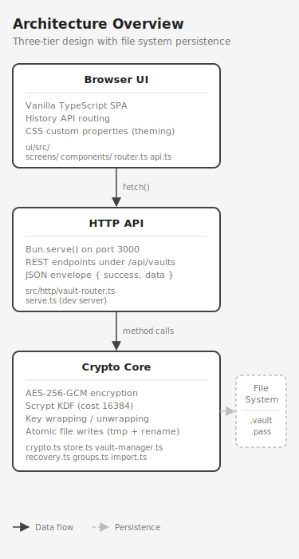

# tkr-secrets

Encrypted secrets vault with a browser UI and REST API. Store API keys, database URLs, and other sensitive credentials in AES-256-GCM encrypted vaults with multi-vault support, group organization, and password recovery via BIP39 mnemonic phrases.

## Quick Start

```bash
# Install dependencies
bun install

# Start the dev server (port 3000, hot reload)
bun run dev

# Open the UI
open http://localhost:3000
```

## What You Get

- **AES-256-GCM encryption** with Scrypt KDF — secrets encrypted at rest
- **Multi-vault** — independent vaults with separate passwords and auto-lock timers
- **Recovery keys** — 24-word BIP39 mnemonic, hex, or QR code to recover a forgotten password
- **Groups and ordering** — organize secrets into named groups with drag-and-drop reorder
- **.env import** — two-phase preview-then-confirm import from standard `.env` files
- **Auto-lock** — configurable timeout zeroes the vault key from memory
- **Stay authenticated** — opt-in macOS Keychain persistence for auto-unlock across restarts
- **Light/dark theme** — follows system preference, toggle in the UI
- **No plaintext export** — secrets never leave the vault unencrypted

## Architecture

Three-tier design: Crypto Core → HTTP API → Browser UI.



See [docs/ARCHITECTURE.md](ARCHITECTURE.md) for the full breakdown.

## Documentation

| Document | Contents |
|----------|----------|
| [ARCHITECTURE.md](ARCHITECTURE.md) | Three-tier design, file structure, data flow |
| [SECURITY.md](SECURITY.md) | Encryption model, key hierarchy, threat model |
| [API.md](API.md) | REST endpoint reference |
| [UI.md](UI.md) | Screen guide, routing, theming |
| [USAGE.md](USAGE.md) | Library exports, programmatic integration |
| [RECOVERY.md](RECOVERY.md) | Recovery key formats, backup best practices |
| [CONTRIBUTING.md](CONTRIBUTING.md) | Dev setup, build, test, conventions |

## Tech Stack

| Layer | Technology |
|-------|-----------|
| Runtime | [Bun](https://bun.sh) |
| Language | TypeScript (strict mode) |
| Encryption | `node:crypto` (AES-256-GCM, Scrypt) |
| Mnemonic | [bip39](https://github.com/bitcoinjs/bip39) |
| QR codes | [qrcode](https://github.com/soldair/node-qrcode) |
| Frontend | Vanilla TypeScript, no framework |
| Routing | History API (SPA) |
| Build | `bun build` |
| Tests | `bun test` |

## Scripts

```bash
bun run dev          # Dev server with hot reload
bun run build        # Build lib + UI
bun run build:lib    # Build library only
bun run build:ui     # Build UI only
bun run typecheck    # TypeScript strict check
bun test             # Run all tests (unit + integration + E2E)
bun run test:integration  # Integration tests only
bun run test:e2e          # E2E tests only
```
