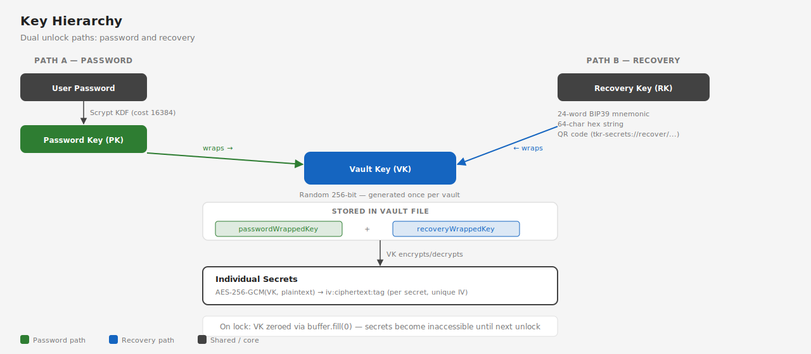

# Recovery & Backup

Recovery keys provide a second path to unlock a vault when the password is forgotten. A new recovery key is generated at vault creation and again after each password recovery.

## Recovery Key Formats

The same 256-bit key is available in three formats:

| Format | Example | Use Case |
|--------|---------|----------|
| **24-word BIP39 mnemonic** | `abandon ability able about above absent absorb ...` | Write on paper, store in safe |
| **64-character hex** | `a3f1c8d2...` | Copy to a secure digital store |
| **QR code** | 300x300 PNG | Scan to recover on another device |

The QR code encodes a URI: `tkr-secrets://recover/{vault-name}?key={hex-recovery-key}`

## How Recovery Works



1. The user provides their recovery key (mnemonic, hex, or QR scan)
2. The system auto-detects the format and parses to a 256-bit key
3. The vault key (VK) is unwrapped from `recoveryWrappedKey` using the recovery key
4. All secrets are decrypted with VK to verify integrity
5. A new password is set by the user
6. A **new recovery key** is generated (the old one becomes invalid)
7. VK is re-wrapped under the new password key and new recovery key
8. All secrets are re-encrypted with new IVs

The new recovery key is shown on the Recovery Key screen, and the user must confirm they've saved it before proceeding.

## Recovery File

The downloadable `.tkr-recovery` file is JSON:

```json
{
  "vault": "production",
  "recoveryKey": "a3f1c8d2...",
  "mnemonic": "word1 word2 ... word24",
  "createdAt": "2026-02-28T10:30:00Z"
}
```

## Best Practices

- **Save the recovery key immediately** — it is only shown once after vault creation or password recovery
- **Use at least two storage methods** — e.g., paper in a safe + encrypted file on a separate device
- **Never store the recovery key alongside the vault file** — they should be in different physical or logical locations
- **Test your recovery key** — after saving it, you can verify by using the Recover screen to reset your password
- **Each recovery invalidates the previous key** — after a successful recovery, a new key is issued and the old one stops working

## Recovery Input Methods

The Recover screen (`/vault/:name/recover`) accepts three input methods:

1. **Enter Phrase** — paste or type the 24-word mnemonic into a text area
2. **Scan QR** — paste the QR code URI (camera scanning is for future implementation)
3. **Upload File** — drag-and-drop or browse for a `.tkr-recovery` file

The system auto-detects whether input is a mnemonic (contains spaces) or hex (64 characters, no spaces).
