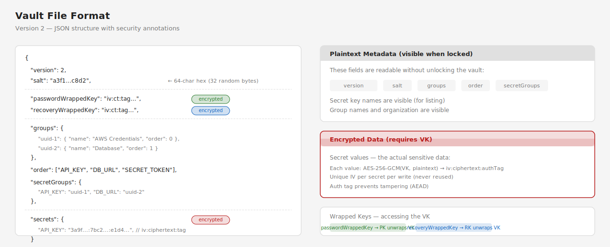

# Security Model

tkr-secrets encrypts all secret values at rest using AES-256-GCM with a key hierarchy that supports both password-based and recovery-based access.

## Key Hierarchy

Three keys are involved in vault operations:

| Key | How It's Created | Stored? |
|-----|-----------------|---------|
| **Password Key (PK)** | Derived from user password via Scrypt KDF | No — re-derived on each unlock |
| **Recovery Key (RK)** | 256-bit random, generated at vault creation | No — shown once, user stores offline |
| **Vault Key (VK)** | 256-bit random, generated at vault creation | Yes — wrapped (encrypted) by PK and RK |

### How Key Wrapping Works

At vault creation:

1. Generate random VK (the actual encryption key for secrets)
2. Derive PK from password + salt via Scrypt
3. Generate random RK
4. Wrap VK under PK → `passwordWrappedKey` (stored in vault file)
5. Wrap VK under RK → `recoveryWrappedKey` (stored in vault file)
6. Return RK to user as mnemonic + hex + QR code

At unlock (password path):

1. Derive PK from password + stored salt
2. Unwrap VK from `passwordWrappedKey` using PK
3. Hold VK in memory — use it to decrypt/encrypt secrets

At unlock (recovery path):

1. Parse recovery key input (mnemonic or hex)
2. Unwrap VK from `recoveryWrappedKey` using RK
3. Generate new password, new salt, new RK
4. Re-wrap VK under new PK and new RK
5. Re-encrypt all secrets with new IVs

## Encryption Details

| Parameter | Value |
|-----------|-------|
| Algorithm | AES-256-GCM (authenticated encryption) |
| Key length | 256 bits (32 bytes) |
| IV length | 96 bits (12 bytes), random per operation |
| Auth tag | 128 bits (16 bytes) |
| KDF | Scrypt |
| Scrypt cost | 16384 |
| Scrypt block size | 8 |
| Scrypt parallelism | 1 |
| Salt | 256 bits (32 bytes), random per vault |

Each secret value is encrypted independently with a unique random IV. The ciphertext format is `iv:ciphertext:tag` encoded as hex strings.

Key wrapping uses the same AES-256-GCM primitive — the vault key is encrypted as if it were a secret value, using PK or RK as the encryption key.

## Memory Safety

- The vault key (VK) is held in a Node.js `Buffer` while unlocked
- On lock (manual or auto-lock timeout), VK is zeroed via `buffer.fill(0)` before being dereferenced
- After zeroing, secrets cannot be decrypted until the next unlock

## Auto-Lock

Each vault has an independent auto-lock timer (default: 5 minutes / 300,000ms). The timer resets on activity. When it fires:

1. VK is zeroed in memory
2. The vault transitions to locked state
3. All subsequent secret operations return HTTP 423

The UI polls vault status every 10 seconds to detect auto-lock and redirect to the unlock screen.

## Keychain Persistence

The stay-authenticated feature optionally stores the vault key (VK) in the macOS Keychain, enabling auto-unlock across server restarts without re-entering the password.

| Aspect | Details |
|--------|---------|
| Storage | macOS Keychain via `security` CLI (generic password) |
| What's stored | The 32-byte vault key (VK) as hex |
| Service name | Configurable (default: `tkr-secrets-vault`) |
| Account name | Vault name |
| Opt-in | User must explicitly check "Stay authenticated" on unlock |
| Clearing | VK removed from keychain on: manual opt-out, vault deletion, password recovery |

Security properties:

- The VK is never written to disk as a file — it lives only in the Keychain
- Keychain access is protected by the user's macOS login password
- Recovery operations reset stay-authenticated state and clear the keychain entry
- Stale keychain entries (where the VK no longer decrypts the vault) are automatically cleaned up
- Keychain failures are non-fatal — the vault falls back to password-based unlock

## File Permissions

| File | Permissions | Contents |
|------|------------|----------|
| `secrets-{name}.enc.json` | Default | Encrypted vault data |

## Atomic Writes

Vault files are written atomically to prevent corruption:

1. Write to a temporary file in the same directory
2. `renameSync()` the temp file over the target path

If the process crashes during step 1, the original vault file remains intact. `renameSync` is atomic on POSIX filesystems.

## Vault File Format

The v2 vault file is a JSON document. Some fields are plaintext metadata, others are encrypted:

**Visible when locked** (plaintext):
- `version`, `salt` — needed for key derivation
- `passwordWrappedKey`, `recoveryWrappedKey` — encrypted blobs (VK wrapped under PK/RK)
- `groups` — group names and order (organizational metadata)
- `order` — secret key display order
- `secretGroups` — which secret belongs to which group
- Secret key names (the keys in the `secrets` object)

**Requires VK to access** (encrypted):
- Secret values (the values in the `secrets` object) — each is `iv:ciphertext:tag`

This means an attacker with file access can see *how many* secrets exist and their *names*, but not their *values*. Group names and organization are also visible. This is a deliberate trade-off: listing secrets by name while locked enables the UI to show vault structure without requiring unlock.

## What's Not Encrypted

- Vault names (derived from filenames)
- Secret key names (needed for listing while locked)
- Group names and structure
- The fact that a vault exists

## No Plaintext Export

Secrets cannot be exported as plaintext. This is by design — recovery keys serve as the portability mechanism. If a user needs to move secrets to a new system, they use the recovery key to unlock the vault on that system.
