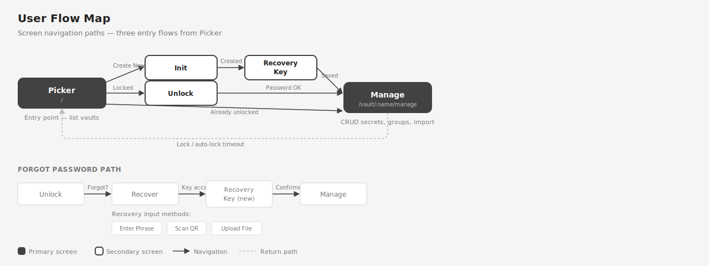

# UI Guide

The browser UI is a vanilla TypeScript SPA served on port 3000 alongside the API. No framework — each screen is a module that exports `render()` and `destroy()` lifecycle functions.

## Screen Flow



Six screens connected by three primary paths from the Picker:

| Screen | Route | Purpose |
|--------|-------|---------|
| **Picker** | `/` | Entry point — list all vaults, select or create |
| **Init** | `/vault/new` | Create a new vault (name + password) |
| **Unlock** | `/vault/:name/unlock` | Enter password for a locked vault |
| **Manage** | `/vault/:name/manage` | CRUD secrets, groups, import, settings |
| **Recovery Key** | `/vault/:name/recovery-key` | Display recovery key after creation or recovery |
| **Recover** | `/vault/:name/recover` | Reset password using recovery key |

### Navigation Paths

1. **Create flow**: Picker → Init → Recovery Key → Manage
2. **Unlock flow**: Picker → Unlock → Manage
3. **Direct access**: Picker → Manage (vault already unlocked)
4. **Forgot password**: Unlock → Recover → Recovery Key → Manage
5. **Lock return**: Manage → Picker (on lock or auto-lock)

## Screen Details

### Picker (`/`)

Lists all registered vaults as cards in a grid layout. Each card shows:
- Lock/unlock status icon and badge
- Vault name
- Secret and group counts (when unlocked)
- Last accessed timestamp
- Delete button (progressive confirmation)

A "Create New Vault" card with a `+` icon appears at the end. Polls for updates every 30 seconds.

### Init (`/vault/new`)

New vault creation form:
- Vault name input (validated: lowercase, alphanumeric, hyphens)
- Password + confirm password (with show/hide toggle)
- Creates vault and navigates to Recovery Key screen

### Unlock (`/vault/:name/unlock`)

Password entry for a locked vault:
- Password input with show/hide toggle
- "Stay authenticated" checkbox (visible when macOS Keychain is available)
- "Forgot password?" link → Recover screen

### Manage (`/vault/:name/manage`)

Primary workspace for an unlocked vault:
- Secret list with groups, inline editing
- Drag-and-drop reorder
- Group creation, renaming, deletion
- .env import
- Settings (change password, lock)
- Session timeout progress bar
- Polls status every 10 seconds for auto-lock detection

### Recovery Key (`/vault/:name/recovery-key`)

Shown after vault creation or password recovery:
- QR code (300x300 PNG)
- 24-word mnemonic in a numbered grid (2-column mobile, 4-column desktop)
- Copy mnemonic button
- Download recovery file button (`.tkr-recovery` JSON)
- Confirmation checkbox required before continuing
- `beforeunload` guard prevents accidental navigation

### Recover (`/vault/:name/recover`)

Three input methods via tabs:
- **Enter Phrase** — textarea for 24-word mnemonic
- **Scan QR** — paste QR URI
- **Upload File** — drag-and-drop or file picker for `.tkr-recovery` file

After a valid recovery key is accepted:
- New password + confirm password fields appear
- Submit resets the password and generates a new recovery key

## Routing

The SPA router (`ui/src/router.ts`) uses the History API with parameterized paths:

```
/                           → Picker
/vault/new                  → Init
/vault/:name/unlock         → Unlock
/vault/:name/manage         → Manage
/vault/:name/recovery-key   → Recovery Key
/vault/:name/recover        → Recover
```

The router calls `destroy()` on the current screen and `render()` on the new one. The `:name` parameter is extracted and passed to screen handlers.

## Theming

The UI supports light and dark themes via CSS custom properties.

| Behavior | Details |
|----------|---------|
| Default | Follows `prefers-color-scheme` system setting |
| Toggle | Sun/moon icon in the footer |
| Persistence | `localStorage` key `tkr-theme` |
| Implementation | CSS custom properties set on `:root` |

Design tokens (colors, spacing, typography, radii, transitions) are documented in [spec-docs/DESIGN-TOKENS.md](../spec-docs/DESIGN-TOKENS.md).

## Wireframes

All six UI screens have mobile (375px) and desktop (1280px) SVG wireframes in `wireframes/vault/`:

| Screen | Mobile | Desktop |
|--------|--------|---------|
| Picker | `vault-picker.svg` | `vault-picker-desktop.svg` |
| Init | `vault-init.svg` | `vault-init-desktop.svg` |
| Unlock | `vault-unlock.svg` | `vault-unlock-desktop.svg` |
| Manage | `vault-manage.svg` | `vault-manage-desktop.svg` |
| Recovery Key | `vault-recovery-key.svg` | `vault-recovery-key-desktop.svg` |
| Recover | `vault-recover.svg` | `vault-recover-desktop.svg` |
